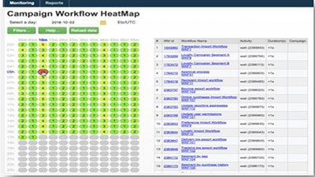
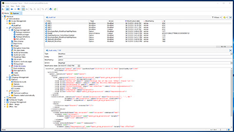
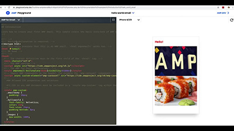

# Tutorial su Adobe Campaign Classic v7: panoramica

Adobe Campaign fornisce una piattaforma per la progettazione di customer experience cross-channel e un ambiente per l’orchestrazione visiva delle campagne, la gestione delle interazioni in tempo reale e l’esecuzione cross-channel. La presente guida utente contiene video e tutorial sulle numerose funzioni e caratteristiche di Adobe Campaign Classic v7.

>[!INFO]
> Hai delle domande? Vuoi condividere la tua esperienza o scambiare idee con altri utenti? O forse vuoi inviare al team Adobe un feedback sui contenuti di apprendimento? Partecipa alla conversazione nel [thread della community di apprendimento Adobe Campaign](https://experienceleaguecommunities.adobe.com:443/t5/adobe-campaign-classic/join-the-discussion-on-adobe-campaign-learning/td-p/419096).

## Novità

* **[Integrare con Adobe Target](/help/integrations/target-integration.md)**

   *Scopri come personalizzare una consegna con contenuti dinamici forniti da Adobe Target.*

* **[Creare campagne cross-channel](/help/orchestrating-campaigns/cross-channel-campaigns.md)**

   *Scopri come creare ed eseguire una campagna cross-channel.*

* **[Utilizzare i gruppi di controllo](/help/sending-messages/email-channel/use-control-groups.md)**

   *Scopri il concetto di gruppi di controllo e come utilizzarli per la consegna.*

## Tutorial scelti dal personale

<table>
<tr>
  <td>
    
    

      <a href="./monitoring-campaign-classic/workflow-heatmap.md">
    <strong>Workflow Heatmap</strong>
    </a>
    

    

    <em>Visualizza una panoramica del numero di flussi di lavoro simultanei.</em>
    

  </td>
   <td>
    
    

      <a href="./monitoring-campaign-classic/audit-trail.md">
    <strong>Audit Trail</strong>
    </a>
    
 
    

    <em>Acquisisci un elenco completo delle azioni e degli eventi che si verificano all’interno di Adobe Campaign.</em>
    

  </td>
  <td>
    
    

      <a href="./sending-messages/email-channel/defining-interactive-email-content-with-amp.md">
    <strong>Definizione del contenuto delle e-mail interattive con AMP</strong>
    </a>
    

    

    <em>Scopri come attivare e utilizzare AMP in Adobe Campaign Classic </em>
    

  </td>
</tr>
</table>

## Risorse aggiuntive

* [Documentazione](https://experienceleague.adobe.com/docs/campaign-classic/using/getting-started/starting-with-adobe-campaign/about-adobe-campaign-classic.html?lang=it)
